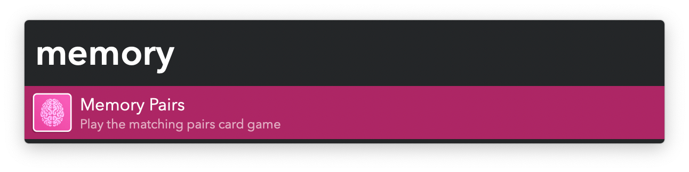
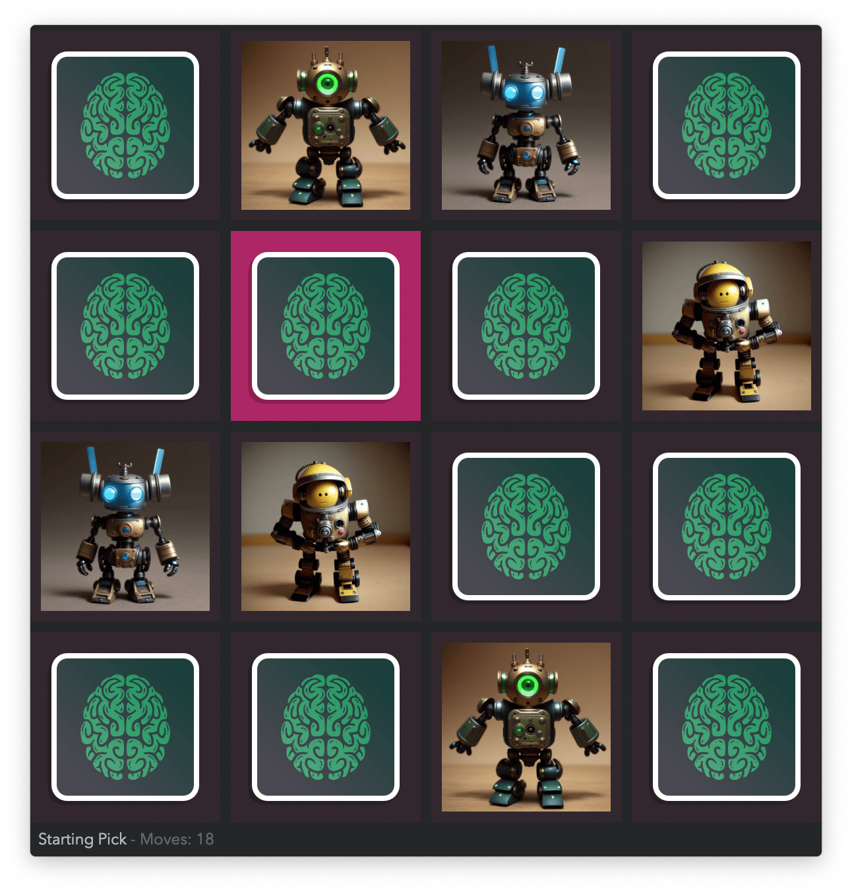

#  Memory Pairs Alfred Workflow

Play the matching pairs card game

[⤓ Install on the Alfred Gallery](https://alfred.app/workflows/vitor/memory-pairs)

## Usage

Play the [matching pairs game](https://en.wikipedia.org/wiki/Concentration_%28card_game%29) via the `memory` keyword.

* <kbd>↩&#xFE0E;</kbd> Reveal card.
* <kbd>⌘</kbd><kbd>↩&#xFE0E;</kbd> Start new game.

Increase the difficulty and change the set of images in the [Workflow’s Configuration](https://www.alfredapp.com/help/workflows/user-configuration/).
